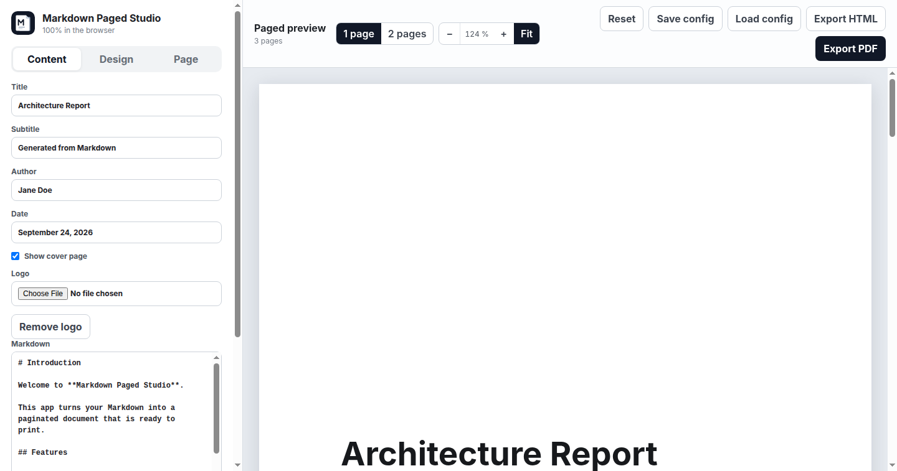
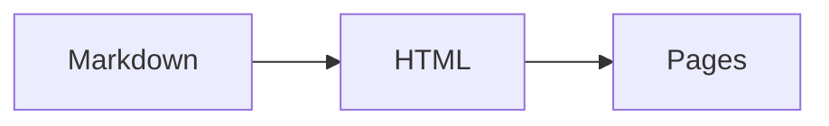
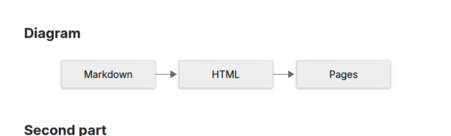
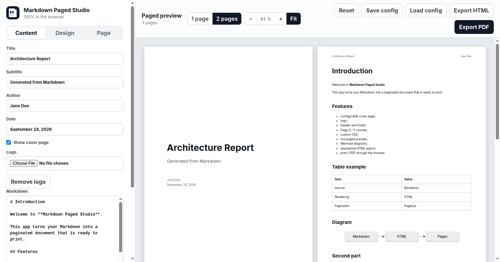
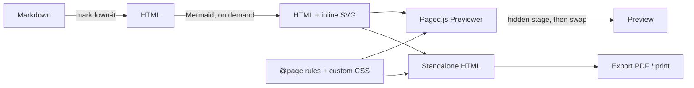

<p align="center">
  
</p>

<h1 align="center">Markdown Paged Studio</h1>

<p align="center">
  Write Markdown, add your own CSS, and get a paginated, print-ready document with a cover page, headers, footers, page numbers and Mermaid diagrams.<br />
  Everything runs in the browser. No backend, no account, no tracking.
</p>

<p align="center">
  <a href="https://github.com/florianlotte/markdown-paged-studio/actions/workflows/ci.yml"></a>
  
  
  
  
  
</p>



## Features

- **Live paged preview** powered by [Paged.js](https://pagedjs.org): what you see is what prints.
- **Cover page** with title, subtitle, author, date and an optional logo.
- **Running header** (left and right), **footer**, and an automatic `Page X / Y` counter.
- **A4, Letter or A5** with configurable margins.
- **Mermaid diagrams** from ` ```mermaid ` code fences, rendered to SVG and embedded in exports.
- **Custom CSS** editor with import, applied to the document only.
- **Preview controls**: one page or two pages side by side, zoom, fit to width, Ctrl + wheel.
- **Autosave** in the browser, plus export and import of the whole configuration as JSON.
- **Standalone HTML export** that paginates offline, and **print / PDF** through the browser dialog.
- **Static build** you can host anywhere: GitHub Pages, Netlify, Cloudflare Pages, nginx.

## Quick start

```bash
npm install
npm run dev
```

Open the URL Vite prints. To ship it:

```bash
npm run build     # static site in dist/
npm run preview   # serve dist/ locally to check the build
```

Node.js 20.19 or newer (or 22.12+) is required by Vite 8.

## Usage

### Writing

The **Content** tab holds the Markdown editor. Import an existing `.md` file or download the current one. The parser is [markdown-it](https://github.com/markdown-it/markdown-it) with CommonMark, tables, automatic links and typographic replacements. Raw HTML inside Markdown is intentionally disabled.

### Diagrams

Any fenced code block tagged `mermaid` becomes an inline SVG:

````markdown

````

Every diagram type supported by [Mermaid](https://mermaid.js.org) works. Diagrams are rendered before pagination, so Paged.js knows their exact size, and the resulting SVG is part of the exported file. A diagram with a syntax error shows its error message and source in place, without breaking the rest of the document. Mermaid is loaded on demand the first time a document contains a diagram.



### Cover page, header and footer

- **Content** tab: title, subtitle, author, date, the cover page toggle, and the logo (any image, kept as a data URL).
- **Design** tab: header title (top left), header name (top right) and footer text (bottom left). The page counter always sits at the bottom right.

### Page setup

The **Page** tab selects the paper size, the four margins in millimetres, and the document language as a BCP 47 tag (`en`, `fr`, `pt-BR`…). The language sets `lang` on the rendered document and on the exported file, which drives hyphenation (`hyphens: auto` in the sample CSS) and the typographic quotes produced by the Markdown parser (« » in French, „ “ in German…). The cover page ignores margins and headers.

### Custom CSS

The **Design** tab has a CSS editor. Its content is appended after the built-in styles, so your rules win on equal specificity. The rendered document has this structure:

```html
<section class="cover-page">
  
  <h1 class="cover-title">…</h1>
  <div class="cover-subtitle">…</div>
  <div class="cover-meta">
    <div>author</div>
    <div>date</div>
  </div>
</section>
<article class="document-content">…your Markdown as HTML…</article>
```

Diagrams live in `.mermaid-diagram`; a failed diagram is a `<pre class="mermaid-error">`. Use print units (`mm`, `pt`) and paged-media properties such as `break-before: page` or `break-inside: avoid`. A minimal example:

```css
.document-content {
  font-family: Georgia, serif;
  font-size: 11pt;
}
.document-content h2 {
  break-before: page;
}
.cover-title {
  color: #1d4ed8;
}
```

**Sample CSS** restores the default stylesheet.

### Preview controls

| Control                         | Effect                                                                                        |
| ------------------------------- | --------------------------------------------------------------------------------------------- |
| **1 page** / **2 pages**        | One continuous column, or two pages side by side                                              |
| **−** / **+**                   | Zoom out or in by 10 %, between 25 % and 300 %                                                |
| **Fit**                         | Fit the page (or the pair of pages) to the available width, and keep following window resizes |
| **Ctrl + wheel** (Cmd on macOS) | Zoom with the mouse over the preview                                                          |



Layout and zoom are remembered in the browser, separately from the document.

### Personal defaults

To start every session with your own name, company logo, stylesheet or document template, put them in the gitignored `local/` folder: `local/config.json` for the text fields and page setup, `local/logo.png` (or `.svg`, `.jpg`, `.webp`, `.gif`) for the cover logo, `local/custom.css` and `local/template.md` for the defaults of the two editors. They apply on first launch and on **Reset**, and a document saved in the browser always takes precedence. See [local/README.md](local/README.md) for details.

### Saving your work

The document autosaves in the browser after every change. **Reset** discards it and restores the sample. **Save config** downloads everything (texts, Markdown, CSS, logo, page setup) as one JSON file, and **Load config** restores it. Unknown keys and invalid values in an imported file are ignored.

### Export and print

- **Export HTML** downloads a single self-contained file: content, styles, diagrams and the Paged.js runtime. It paginates on open, offline, in any modern browser.
- **Export PDF** is the same button everywhere, with the best implementation available:
  - in the browser it opens the print-ready document in a new tab and triggers the print dialog once pagination is complete; choose _Save as PDF_. Allow pop-ups for the site if nothing opens. Ctrl+P (Cmd+P on macOS) does the same;
  - in the desktop app it writes the PDF directly through the embedded Chromium engine, no dialog other than the file picker.
- **Printing on paper**: in the browser, the same print dialog; in the desktop app, **File → Print…** (Ctrl+P).

Chromium-based browsers give the most faithful print output for paged media.

## How it works



- `documentHtml()` renders the Markdown and replaces every Mermaid placeholder with its SVG.
- `documentCss()` builds the `@page` rules (size, margins, margin boxes for header, footer and counter), the cover styles, and appends your CSS.
- Each render paginates into a hidden container and swaps the pages into the preview in one step, so typing never flashes an empty preview and a newer edit cancels the previous pagination.
- The export inlines the exact Paged.js build used by the preview, so both always match.

## Desktop app

The same application ships as a portable desktop app built with Electron, with Chromium embedded so the preview and the PDF output are identical on every platform. Binaries are attached to each [GitHub Release](https://github.com/florianlotte/markdown-paged-studio/releases): a portable `.exe` for Windows (no installation; the saved document and view settings live in a `markdown-paged-studio-data` folder next to the executable), an `AppImage` for Linux, and a `dmg` / `zip` for macOS. The binaries are not code-signed, so Windows SmartScreen and macOS Gatekeeper will ask for confirmation on first launch.

In the desktop app, **Export PDF** writes the file directly through the embedded Chromium engine instead of going through a print dialog, and **File → Print…** (Ctrl+P) prints on paper. Everything else works exactly as in the browser, including the personal defaults from `local/` baked in at build time.

From the sources:

```bash
npm run desktop         # build dist/ and open the app
npm run desktop:build   # package for the current OS into release/
npm run test:desktop    # Playwright smoke test of the Electron app (run npm run build first)
```

Binaries are built by the `Desktop release` workflow (`.github/workflows/release-desktop.yml`). Run it manually from the **Actions** tab with **Run workflow**: the three binaries are attached to the run as downloadable artifacts, and ticking **publish** also creates the GitHub Release `v<version>` with them. Pushing a tag `v*` publishes the release automatically. Bump `version` in `package.json` first, since it names the artifacts and the release.

## Docker

The image builds the static site and serves it with nginx. No runtime configuration is needed.

```bash
docker compose up --build -d   # then open http://localhost:8080
```

Or without Compose:

```bash
docker build -t markdown-paged-studio .
docker run --rm -p 8080:80 markdown-paged-studio
```

The build context includes the gitignored `local/` folder, so an image built on your machine carries your personal defaults. Keep such images private, or build from a clean checkout for a public image.

## Development

Every push and pull request runs the GitHub Actions workflow in `.github/workflows/ci.yml`: lint, Prettier check, the Playwright suite, the Vite build, and a Docker build with a smoke test of the container.

| Script                 | What it does                          |
| ---------------------- | ------------------------------------- |
| `npm run dev`          | Start the Vite dev server             |
| `npm run build`        | Build the static site into `dist/`    |
| `npm run preview`      | Serve the build locally               |
| `npm run lint`         | ESLint (flat config, browser globals) |
| `npm run format`       | Prettier over the whole repository    |
| `npm run format:check` | Prettier in check mode                |

Project layout:

```
index.html          entry point
Dockerfile          two-stage image: Vite build, then nginx serving dist/
electron/            Electron main process, sandboxed preload and app icon
electron-builder.yml packaging targets: Windows portable exe, Linux AppImage, macOS dmg and zip
src/main.js         the whole application: state, templates, rendering, export
src/ui.css          studio chrome (sidebar, toolbar, preview frame)
src/assets/logo.svg logo and favicon
docs/screenshots/   images used in this README
```

The rendered document is styled only by the CSS generated in `documentCss()`, never by `src/ui.css`. The integration tests in `tests/` drive the real studio in a headless Chromium, since Paged.js needs a browser to lay out pages: rendering, scrolling, re-render hygiene, Mermaid, autosave, config validation, layout and zoom, export, print and the JSON round trip. Run `npx playwright install chromium --only-shell` once before `npm test`.

## Browser support

Recent Chromium-based browsers (Chrome, Edge, Brave, Arc) are the reference for both the preview and printing. Firefox 126+ and Safari 17+ run the studio; the preview zoom relies on the standard CSS `zoom` property. Print output from non-Chromium browsers may differ in margin boxes and page breaks.

## Roadmap

- Table of contents with page numbers (`target-counter`)
- Running headers taken from headings (`string-set`) and left/right page styles
- Bundled font so preview, print and export always match
- Cover page templates and a cover height that follows A5 and Letter
- Syntax highlighting in code blocks

## Contributing

Issues and pull requests are welcome. Before opening a pull request, run `npm run lint`, `npm run format` and `npm test`, and check the preview, the export and the print flow in a Chromium-based browser.

## License

[MIT](LICENSE) © 2026 Florian Lotte
