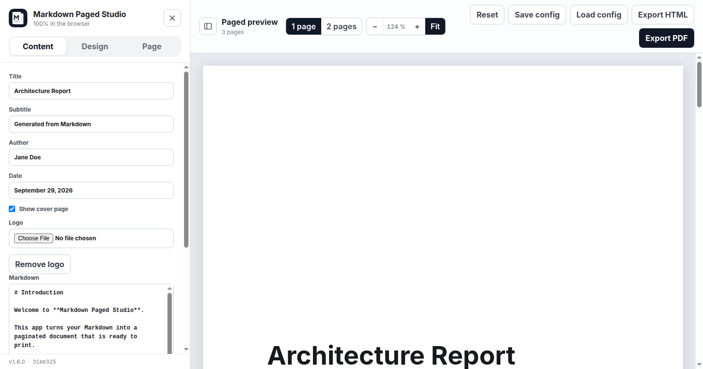
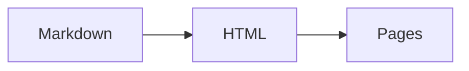
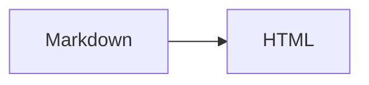
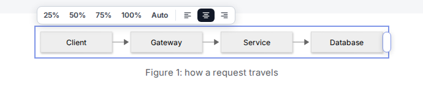
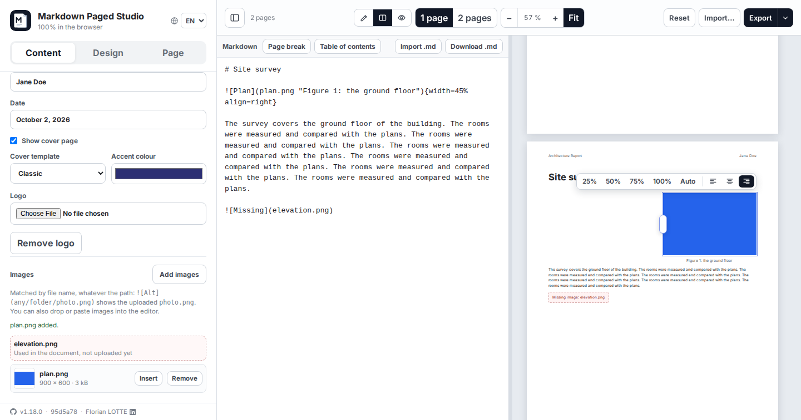
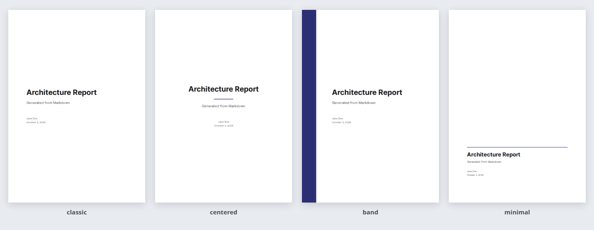
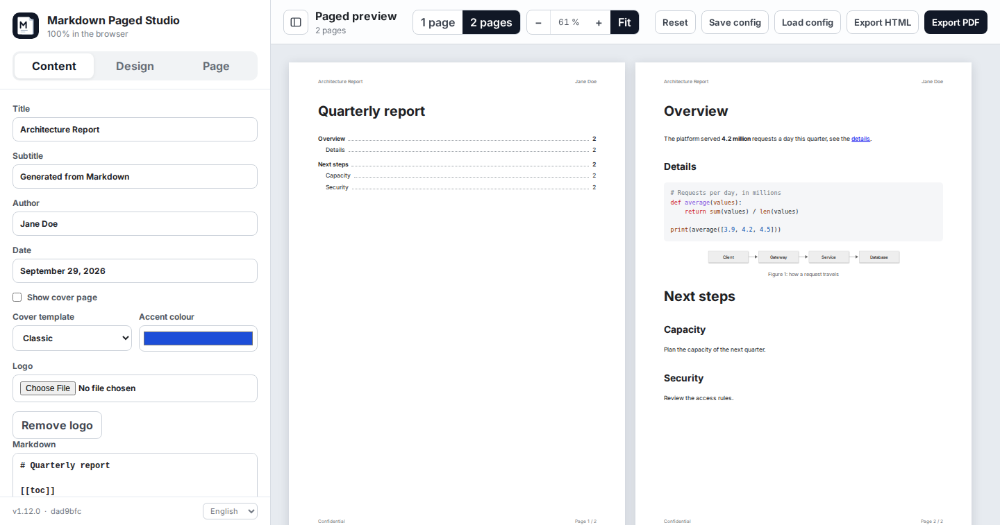
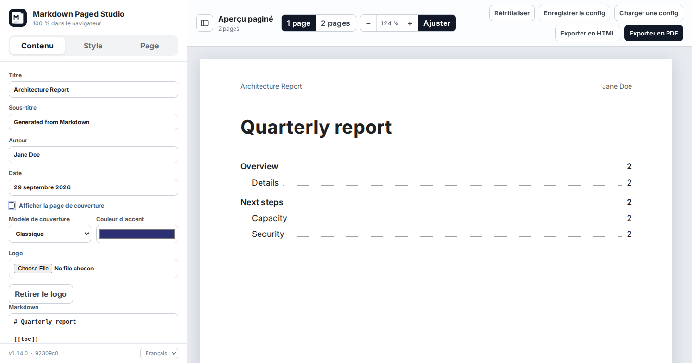
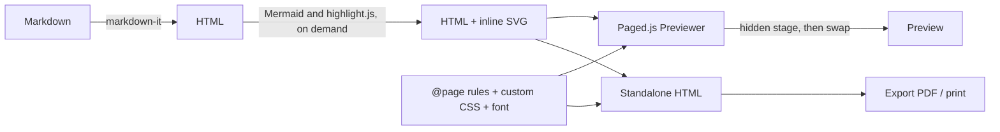

<p align="center">
  
</p>

<h1 align="center">Markdown Paged Studio</h1>

<p align="center">
  Write Markdown, add your own CSS, and get a paginated, print-ready document with a cover page, a table of contents, headers, footers, page numbers and Mermaid diagrams.<br />
  Everything runs in the browser. No backend, no account, no tracking.
</p>

<p align="center">
  <a href="https://github.com/florianlotte/markdown-paged-studio/actions/workflows/ci.yml"></a>
  
  
  
  
  
  <a href="https://github.com/florianlotte/markdown-paged-studio/releases/latest"></a>
  <a href="https://github.com/sponsors/florianlotte"></a>
</p>

**Try it online: [florianlotte.github.io/markdown-paged-studio](https://florianlotte.github.io/markdown-paged-studio/)** (deployed from `main` by GitHub Actions; your documents stay in your browser).



## Features

- **Live paged preview** powered by [Paged.js](https://pagedjs.org): what you see is what prints.
- **Bundled font**: Inter ships with the studio and is embedded in every export, so the preview, the print and the PDF look the same on any machine.
- **Cover page** with title, subtitle, author, date and an optional logo, in four templates with an accent colour.
- **Table of contents** with page numbers from `[[toc]]`, **page breaks** from `\newpage`, and **footnotes** at the foot of the page.
- **Running header** (left and right, or the current chapter), **footer**, and an automatic `Page X / Y` counter.
- **A4, Letter or A5** with configurable margins, mirrored on facing pages if you print double-sided.
- **Syntax highlighting** of code blocks, light or dark, and **captions** under images and diagrams.
- **Mermaid diagrams** from ` ```mermaid ` code fences, rendered to SVG and embedded in exports, resizable by dragging in the preview.
- **Document language** (BCP 47 tag) driving hyphenation and typographic quotes (« » in French, „ “ in German…).
- **Images** uploaded, dropped or pasted, matched to the Markdown by file name, resizable like the diagrams.
- **Custom CSS** editor with import, applied to the document only.
- **Interface in English or French**, following the browser or your choice.
- **Preview controls**: one page or two pages side by side, zoom, fit to width, Ctrl + wheel, and a collapsible sidebar.
- **Autosave** in the browser, plus export and import of the whole configuration as JSON.
- **Personal defaults** (your name, company logo, stylesheet, template) from a gitignored `local/` folder.
- **Standalone HTML export** that paginates offline, and **Export PDF**: the print dialog in the browser, a direct file in the desktop app.
- **Desktop app** for Windows (x64 and ARM64), Linux and macOS (Apple Silicon and Intel), portable, no installation.
- **MCP server** so a local AI assistant can generate reports through the same rendering pipeline.
- **Static build** you can host anywhere: GitHub Pages, Netlify, Cloudflare Pages, nginx, or the provided Docker image.

## Quick start

```bash
npm install
npm run dev
```

Open the URL Vite prints. To ship it:

```bash
npm run build     # static site in dist/
npm run preview   # serve dist/ locally to check the build
```

Node.js 20.19 or newer (or 22.12+) is required by Vite 8.

## Usage

### Writing

The **Content** tab holds the Markdown editor. Import an existing `.md` file or download the current one. The parser is [markdown-it](https://github.com/markdown-it/markdown-it): all of [CommonMark](https://commonmark.org) and of GitHub Flavored Markdown (tables, strikethrough, task lists, automatic links), plus footnotes and typographic replacements. Raw HTML inside Markdown is intentionally disabled. [Markdown support](docs/markdown-support.md) lists what is understood, the four deliberate differences with the specification, what is not supported (formulas, definition lists…), and the conformance measured on the official examples.

Whatever the studio writes into the editor for you (the insert buttons, a pasted image, a size set from the preview) is an ordinary edit: Ctrl+Z undoes it like something you typed.

### Diagrams

Any fenced code block tagged `mermaid` becomes an inline SVG:

````markdown

```mermaid
flowchart LR
  A[Markdown] --> B[HTML]
  B --> C[Pages]
```
````

To size a diagram, add attributes after the language on the opening line:

````markdown

```mermaid width=60% align=left
flowchart LR
  A[Markdown] --> B[HTML]
```
````

| Attribute | Values                             | Effect                                                               |
| --------- | ---------------------------------- | -------------------------------------------------------------------- |
| `width`   | `10%` to `100%`, or a size in `mm` | Width as a share of the text column, or absolute; the height follows |
| `align`   | `left`, `center`, `right`          | Horizontal position, centered by default                             |
| `caption` | text, in double quotes             | Caption shown under the diagram: `caption="Figure 2: the flow"`      |

You rarely need to type the size and the alignment: hover or click a diagram in the preview to get size presets (25, 50, 75, 100 %, natural size), alignment buttons and a handle to drag, which also answers to the arrow keys in 5 % steps. A clicked diagram keeps its tools open, also on touch screens, until you click elsewhere or press Escape, so several adjustments can follow one another.

Every change is written back to that opening line, so the size travels with the Markdown into exports, the desktop app and the MCP server. Ctrl+Z undoes it, in the editor or straight from the preview (also when the sidebar is hidden). Without attributes a diagram keeps its natural size, and it is never taller than the text area of a page.

Every diagram type supported by [Mermaid](https://mermaid.js.org) works. Diagrams are rendered before pagination, so Paged.js knows their exact size, and the resulting SVG is part of the exported file. A diagram with a syntax error shows its error message and source in place, without breaking the rest of the document. Mermaid is loaded on demand the first time a document contains a diagram.



### Structure: table of contents, page breaks, footnotes, code

| Write                           | To get                                                                                                 |
| ------------------------------- | ------------------------------------------------------------------------------------------------------ |
| `[[toc]]` alone on a line       | The table of contents of the headings that follow it (levels 1 to 3), with their page numbers          |
| `[[toc depth=2]]`               | The same, down to the given level (1 to 6)                                                             |
| `\newpage` alone on a line      | A page break                                                                                           |
| `Text[^1]` and `[^1]: The note` | A footnote, numbered and printed at the foot of the page that calls it; `^[a note]` writes it in place |
| `- [ ] to do`, `- [x] done`     | A task list with check boxes                                                                           |
| ` ```js ` … ` ``` `             | A code block highlighted for its language (about 35 common languages); unknown ones stay plain         |

The **Page break** and **Table of contents** buttons under the editor write the markers at the cursor. The table lists what comes after it: a heading placed above it, such as "Contents", is not part of it. Clicking an entry in the preview scrolls to its page.

Every heading gets an anchor named after its text, the way GitHub does: `[see the details](#details)` links to the heading "Details", in the preview and in the exports. Two headings with the same text are told apart with a number (`#details-2`).

The theme of the code blocks (light, dark or none) is chosen in the **Design** tab. The highlighter is loaded on demand, the first time a document contains a code block with a language.

### Images

Add the images of your document with **Add images** in the Content tab, by dropping files on the editor, or by pasting from the clipboard. They are matched to the Markdown **by file name only**, whatever the path and the letter case:

```markdown


```

All three show the uploaded `plan.png`. An existing Markdown file therefore works as it is: import it, then upload its images. Images that the document uses but that are not uploaded yet are listed in the Images section and shown as a "Missing image" box in the page. Uploading a file with the same name replaces the image.

Size and align an image with attributes in braces right after it, or with the same preview tools as the diagrams (hover or click the image):

```markdown
{width=70% align=center}
```

`width` is a share of the text column (`10%` to `100%`, the cell in a table) or a size in `mm`. `align` places the image, and what it does depends on where the image is written:

| Image             | No `align`      | `align=left`                          | `align=center`                 | `align=right`                          |
| ----------------- | --------------- | ------------------------------------- | ------------------------------ | -------------------------------------- |
| Alone on its line | centered        | on the left                           | centered                       | on the right                           |
| Inside text       | in the sentence | floats left, the text wraps around it | on a line of its own, centered | floats right, the text wraps around it |

An image is inside text as soon as its paragraph holds something else: a sentence, a line of text right below it, another image. Headings, tables, code blocks and diagrams always start below a floating image. Without `width` an image keeps its natural size, never wider than the text column nor taller than the text area of a page.

A caption goes in the title of the image, or in a `caption` attribute like the one of the diagrams:

```markdown

{width=60% caption="Figure 1: the ground floor"}
```

Captions are not numbered automatically: write the number yourself. Every image has the preview tools, wherever it is: in a paragraph, a list, a quote, a table cell or a link.



Good to know:

- Images are stored in the browser (IndexedDB) and travel in the configuration file of **Save config**, which is then a complete document. **Reset** removes them.
- A raster image wider than 2400 px is scaled down to that width on upload (300 dpi across an A4 text column); SVG and GIF files are never modified.
- Remote images (`https://…`) are left to the browser: they need the network, also in an exported file.
- Two images with the same file name in different folders cannot be told apart: rename one of them.

### Cover page, header and footer



- **Content** tab: title, subtitle, author, date, the cover page toggle, the logo (any image; wider than 1200 px it is scaled down), and the cover template (classic, centered, colour band, minimal) with its accent colour. The templates arrange the same content, so a stylesheet written for one works with the others.
- **Design** tab: header title (top left), header name (top right) and footer text (bottom left). The page counter always sits at the bottom right. With **Use the current chapter as header title**, the header shows the first-level heading the page belongs to instead of the header title.

### Page setup

The **Page** tab selects the paper size, the four margins in millimetres, and the document language as a BCP 47 tag (`en`, `fr`, `pt-BR`…). The language sets `lang` on the rendered document and on the exported file, which drives hyphenation (`hyphens: auto` in the sample CSS) and the typographic quotes produced by the Markdown parser (« » in French, „ “ in German…). The cover page ignores margins and headers.

**Facing pages** mirrors the left and right margins on left-hand pages, for double-sided printing: the left margin is then the inner one, the page number stays on the outer edge, and the two-page view of the preview pairs the pages as in the bound document.

### Custom CSS

The **Design** tab has a CSS editor. Its content is appended after the built-in styles, so your rules win on equal specificity. The colours of the code theme are the exception: choose **None** as code highlighting to style the code blocks yourself. The rendered document has this structure:

```html
<section class="cover-page">
  
  <h1 class="cover-title">…</h1>
  <div class="cover-subtitle">…</div>
  <div class="cover-meta">
    <div>author</div>
    <div>date</div>
  </div>
</section>
<article class="document-content">…your Markdown as HTML…</article>
```

Inside the content, these class names are stable and meant to be styled:

| Element           | Selector                                                                                                                                                                                                              |
| ----------------- | --------------------------------------------------------------------------------------------------------------------------------------------------------------------------------------------------------------------- |
| Diagram           | `.mermaid-diagram`, its drawing `.mermaid-diagram > svg`; `.is-sized` with `--diagram-width`, `data-align`; a failed one is `.mermaid-error`                                                                          |
| Image             | `.document-image` around the `img`; `.is-block` alone in a paragraph, `.is-sized` with `--image-width`, `data-align`; `.image-missing` if not uploaded                                                                |
| Caption           | `.image-caption`, `.diagram-caption`                                                                                                                                                                                  |
| Table of contents | `nav.toc`, `.toc-item` with `.toc-level-1`…, holding a link with `.toc-text` and `.toc-dots`; the page number is the `::after` of the link                                                                            |
| Page break        | `.page-break`                                                                                                                                                                                                         |
| Footnote          | `.footnote` for the note, `.footnote::footnote-call` for its call in the text, `.footnote::footnote-marker` for its number, `.footnote-ref` for a repeated call; the area of the notes is `@page { @footnote { … } }` |
| Task list         | `.contains-task-list` on the list, `.task-list-item` on the item, holding an `input`                                                                                                                                  |
| Highlighted code  | `pre.code-block` with `.code-light` or `.code-dark`, and highlight.js `.hljs-*` spans                                                                                                                                 |
| Heading           | an `id` made of `sec-` and the anchor name: `#sec-details`                                                                                                                                                            |

Use print units (`mm`, `pt`) and paged-media properties such as `break-before: page` or `break-inside: avoid`. A minimal example:

```css
.document-content {
  font-family: Georgia, serif;
  font-size: 11pt;
}
.document-content h2 {
  break-before: page;
}
.cover-title {
  color: #2c2f73;
}
```

**Sample CSS** restores the default stylesheet.

### Preview controls

| Control                                  | Effect                                                                                                                           |
| ---------------------------------------- | -------------------------------------------------------------------------------------------------------------------------------- |
| **1 page** / **2 pages**                 | One continuous column, or two pages side by side                                                                                 |
| **−** / **+**                            | Zoom out or in by 10 %, between 25 % and 300 %                                                                                   |
| **Fit**                                  | Fit the page (or the pair of pages) to the available width, and keep following window resizes                                    |
| **Ctrl + wheel** (Cmd on macOS)          | Zoom with the mouse over the preview                                                                                             |
| **Sidebar toggle** (left of the toolbar) | Hide or show the settings sidebar to give the preview the full width; in the desktop app also **View → Toggle Sidebar** (Ctrl+B) |
| **Links** of the document                | Open in a new tab (the system browser in the desktop app), so the studio stays in place                                          |



Layout, zoom and the sidebar state are remembered in the browser, separately from the document.

The footer of the sidebar shows which build is running, for example `v1.13.1 · 2205ce9`: the version links to its release notes and the commit to the exact source. It tells apart two deployments of the online demo made between two releases. The GitHub mark in front of it leads to the repository, and the author's name next to it to his LinkedIn profile.

### Interface language

The studio speaks English and French. It follows the language of the browser and the selector at the top of the sidebar, next to the logo, changes it; the choice is remembered on that device. It is a setting of the studio, not of the document: the language of the document, which drives hyphenation and quotes, is set in the **Page** tab.



### Personal defaults

To start every session with your own name, company logo, stylesheet or document template, put them in the gitignored `local/` folder: `local/config.json` for the text fields and page setup, `local/logo.png` (or `.svg`, `.jpg`, `.webp`, `.gif`) for the cover logo, `local/custom.css` and `local/template.md` for the defaults of the two editors. They apply on first launch and on **Reset**, and a document saved in the browser always takes precedence. See [local/README.md](local/README.md) for details.

### Saving your work

The document autosaves in the browser after every change (the logo and the images in IndexedDB, which has room for them). **Reset** discards it and restores the sample. **Save config** downloads everything (texts, Markdown, CSS, logo, images, page setup and options) as one JSON file, and **Load config** restores it. Unknown keys and invalid values in an imported file are ignored.

### Export and print

- **Export HTML** downloads a single self-contained file: content, styles, images, diagrams, the font and the Paged.js runtime. It paginates on open, offline, in any modern browser.
- **Export PDF** is the same button everywhere, with the best implementation available:
  - in the browser it opens the print-ready document in a new tab and triggers the print dialog once pagination is complete; choose _Save as PDF_. Allow pop-ups for the site if nothing opens. Ctrl+P (Cmd+P on macOS) does the same;
  - in the desktop app it writes the PDF directly through the embedded Chromium engine, no dialog other than the file picker.
- **Printing on paper**: in the browser, the same print dialog; in the desktop app, **File → Print…** (Ctrl+P).

Chromium-based browsers give the most faithful print output for paged media.

## How it works


```mermaid
flowchart LR
  MD[Markdown] -->|markdown-it| HTML[HTML]
  HTML -->|"Mermaid and highlight.js, on demand"| SVG["HTML + inline SVG"]
  CSS["@page rules + custom CSS + font"] --> P
  SVG --> P["Paged.js Previewer"]
  P -->|hidden stage, then swap| Preview[Preview]
  SVG --> X["Standalone HTML"]
  CSS --> X
  X --> PDF["Export PDF / print"]
```

- `documentHtml()` renders the Markdown (images resolved by file name, heading anchors, table of contents), replaces every Mermaid placeholder with its SVG and highlights the code blocks.
- `documentCss()` builds the `@page` rules (size, margins, margin boxes for header, footer and counter), the cover template, the built-in styles, and appends your CSS.
- The subsets of the font that the text needs are loaded before pagination, so the pages are measured with the final font, and inlined in the exports.
- Page numbers of the table of contents and the running header are resolved by Paged.js while it lays out the pages.
- Each render paginates into a hidden container and swaps the pages into the preview in one step, so typing never flashes an empty preview and a newer edit cancels the previous pagination.
- The export inlines the exact Paged.js build used by the preview, so both always match.

## Desktop app

The same application ships as a portable desktop app built with Electron, with Chromium embedded so the preview and the PDF output are identical on every platform. Binaries are attached to each [GitHub Release](https://github.com/florianlotte/markdown-paged-studio/releases):

| System  | Files                                     | Notes                                                                                                                               |
| ------- | ----------------------------------------- | ----------------------------------------------------------------------------------------------------------------------------------- |
| Windows | portable `.exe` and `.zip`, x64 and ARM64 | No installation. The `.zip` holds the same app for company PCs that block downloaded executables: unzip, then run the `.exe` inside |
| Linux   | `AppImage`, x86_64                        | Make it executable, then run it                                                                                                     |
| macOS   | `dmg` and `zip`, Apple Silicon and Intel  |                                                                                                                                     |

The portable Windows executable keeps the saved document and the view settings in a `markdown-paged-studio-data` folder next to it. Each release also carries `SHA256SUMS-<os>.txt` files to verify the downloads. The binaries are not code-signed, so Windows SmartScreen and macOS Gatekeeper will ask for confirmation on first launch.

In the desktop app, **Export PDF** writes the file directly through the embedded Chromium engine instead of going through a print dialog, and **File → Print…** (Ctrl+P) prints on paper. Links of the document open in the system browser. Everything else works exactly as in the browser, including the personal defaults from `local/` baked in at build time. The application menu is in French on a French system.

From the sources:

```bash
npm run desktop         # build dist/ and open the app
npm run desktop:build   # package for the current OS into release/
npm run test:desktop    # Playwright smoke test of the Electron app (run npm run build first)
```

Binaries are built by the `Desktop release` workflow (`.github/workflows/release-desktop.yml`). Run it manually from the **Actions** tab with **Run workflow**: the three binaries are attached to the run as downloadable artifacts, and ticking **publish** also creates the GitHub Release `v<version>` with them. Pushing a tag `v*` publishes the release automatically, with notes taken from `CHANGELOG.md`. Bump `version` in `package.json` and add the section of the version to the changelog first: see [CONTRIBUTING.md](CONTRIBUTING.md#releases).

## MCP server for AI assistants

`mcp/server.mjs` is a [Model Context Protocol](https://modelcontextprotocol.io) server (stdio) that lets a local AI assistant generate reports with the real rendering pipeline: it exposes `render_pdf`, `render_html` and `describe_config`, plus a resource documenting the CSS contract. Everything described above works through it: images, table of contents, page breaks, captions, code highlighting, cover templates and page options. Build the app once, then register the server in your client:

```bash
npm run build
claude mcp add markdown-paged-studio -- node /absolute/path/to/markdown-paged-studio/mcp/server.mjs
```

See [mcp/README.md](mcp/README.md) for the Claude Desktop configuration, the tool inputs and the personal defaults handling.

## Docker

The image builds the static site and serves it with nginx. No runtime configuration is needed.

```bash
docker compose up --build -d   # then open http://localhost:8080
```

Or without Compose:

```bash
docker build --build-arg APP_COMMIT=$(git rev-parse --short=7 HEAD) -t markdown-paged-studio .
docker run --rm -p 8080:80 markdown-paged-studio
```

`APP_COMMIT` is optional: the image has no git history, so without it the sidebar footer shows the version only.

The build context includes the gitignored `local/` folder, so an image built on your machine carries your personal defaults. Keep such images private, or build from a clean checkout for a public image.

## Development

GitHub Actions workflows in `.github/workflows/`: `ci.yml` runs on every push and pull request (lint, Prettier check, the web, desktop and MCP test suites, the Vite build, a Docker build with a smoke test of the container); `release-desktop.yml` builds and publishes the desktop binaries on `v*` tags or on demand, once the same checks have passed on that commit (it waits for the CI run of the commit and only runs the checks itself when there is none), with release notes taken from `CHANGELOG.md`; `pages.yml` deploys the web app to GitHub Pages once `ci.yml` has passed on `main`. A commit that fails the tests is neither deployed nor released. Dependabot keeps npm packages and the actions up to date.

| Script                  | What it does                                                                              |
| ----------------------- | ----------------------------------------------------------------------------------------- |
| `npm run dev`           | Start the Vite dev server                                                                 |
| `npm run build`         | Build the static site into `dist/`                                                        |
| `npm run preview`       | Serve the build locally                                                                   |
| `npm run lint`          | ESLint (flat config, browser globals)                                                     |
| `npm run format`        | Prettier over the whole repository                                                        |
| `npm run format:check`  | Prettier in check mode                                                                    |
| `npm test`              | Playwright integration tests of the web app in a headless Chromium (starts Vite itself)   |
| `npm run test:unit`     | Unit tests of the helpers, of the Markdown conformance and of the changelog (Node runner) |
| `npm run desktop`       | Build and open the Electron desktop app                                                   |
| `npm run desktop:build` | Package the desktop app for the current OS into `release/`                                |
| `npm run test:desktop`  | Playwright smoke test of the desktop app (after `npm run build`)                          |
| `npm run mcp`           | Start the MCP server on stdio (after `npm run build`)                                     |
| `npm run test:mcp`      | End-to-end test of the MCP server with a real MCP client (after `npm run build`)          |
| `npm run conformance`   | Measure the parser against the CommonMark and GFM examples (`-- --write` updates the doc) |
| `npm run screenshots`   | Retake the screenshots of this README from the build (after `npm run build`)              |

Project layout:

```
index.html          entry point and the studio markup
vite.config.js      build-time constants: version and commit shown in the sidebar footer
src/main.js         wires the modules: restore, UI, view, first render
src/config.js       defaults (built-in and local/), state, validation, autosave
src/markdown.js     markdown-it rules: images, anchors, table of contents, page breaks; Mermaid, highlighting
src/images.js       image library: matching by file name, storage, upload; logo storage
src/i18n.js         interface language: French translations, applied to the markup
src/editor.js       edits of the Markdown editor that keep its undo history
src/fonts.js        bundled document font: loaded for the preview, inlined in exports
src/font-faces.js   which font subsets a text needs (pure helpers)
src/resize-controls.js resize controls on the diagrams and images of the preview
src/document.js     document CSS (page rules, cover templates, code themes) and HTML, standalone export
src/render.js       Paged.js preview lifecycle, undo history of the preview
src/view.js         layout and zoom of the preview
src/ui.js           form, tabs, files, images, links of the preview, export and print
src/automation.js   headless API used by the MCP server
src/version.js      version and commit of the running build
src/escape.js       escaping of text placed in HTML and in CSS strings
src/ui.css          studio chrome (sidebar, toolbar, preview frame)
src/assets/logo.svg logo and favicon
electron/           Electron main process, sandboxed preload and app icon
electron-builder.yml packaging targets: Windows portable exe and zip, Linux AppImage, macOS dmg and zip
mcp/                MCP server (stdio) rendering reports headlessly through dist/
Dockerfile          two-stage image: Vite build, then nginx serving dist/
docs/screenshots/   images used in this README, taken by scripts/screenshots.mjs
scripts/            release notes from the changelog, README screenshots, Markdown conformance
docs/markdown-support.md supported Markdown, deliberate differences, measured conformance
tests/              web (studio-*.spec.js), desktop, MCP and unit tests
.github/            workflows, Dependabot, issue forms and pull request template
```

The rendered document is styled only by the CSS generated in `documentCss()`, never by `src/ui.css`. The integration tests in `tests/studio-*.spec.js` (one file per domain, shared helpers in `tests/helpers/studio.mjs`) drive the real studio in a headless Chromium, since Paged.js needs a browser to lay out pages: the document and its exports, the layout of the studio, diagrams, images, editing and undo, the document features and the interface language. If port 5173 is busy, `PORT=5183 npm test` uses another one. Run `npx playwright install chromium --only-shell` once before `npm test`.

## Browser support

Recent Chromium-based browsers (Chrome, Edge, Brave, Arc) are the reference for both the preview and printing. On phones and narrow windows the settings open as a full-screen drawer over the preview, and the toolbar actions scroll horizontally. Firefox 126+ and Safari 17+ have what the studio relies on (the CSS `zoom` property for the preview zoom, among others), but only Chromium is covered by the automated tests. Print output from non-Chromium browsers may differ in margin boxes and page breaks.

## Roadmap

- Automatic numbering of figures and headings
- Dark theme for the studio
- More interface languages
- Code signing of the desktop binaries (Windows and macOS)

## Contributing

Issues and pull requests are welcome: [CONTRIBUTING.md](CONTRIBUTING.md) explains how to set up the project, what to run before a pull request and the few rules of the code base. What changed in each version is in [CHANGELOG.md](CHANGELOG.md). To report a security problem, follow the [security policy](SECURITY.md).

## About me

**Florian LOTTE**, author and maintainer of Markdown Paged Studio. Feedback, ideas and use cases are welcome, in an issue or directly on [LinkedIn](https://www.linkedin.com/in/florianlotte/).

If the studio saves you time, you can support its development through [GitHub Sponsors](https://github.com/sponsors/florianlotte).

[](https://github.com/sponsors/florianlotte)

## License

[MIT](LICENSE) © 2026 Florian Lotte

The specification examples used by the conformance tests ([CommonMark](https://spec.commonmark.org), [GFM](https://github.github.com/gfm/)) are under CC BY-SA 4.0 and are not part of the application. Code highlighting uses [highlight.js](https://highlightjs.org) (BSD 3-Clause). The bundled font, [Inter](https://rsms.me/inter/), is licensed under the [SIL Open Font License 1.1](https://openfontlicense.org).
